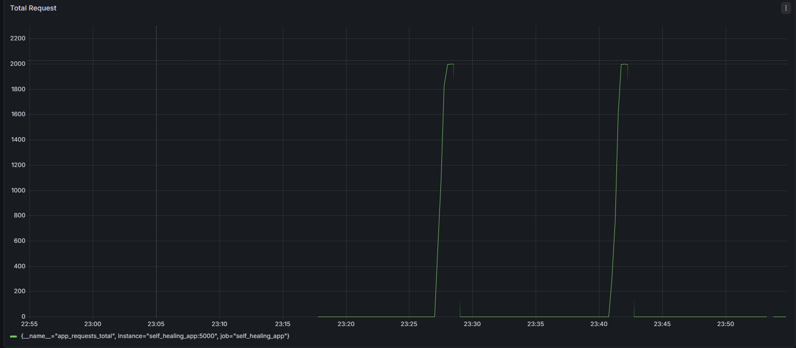
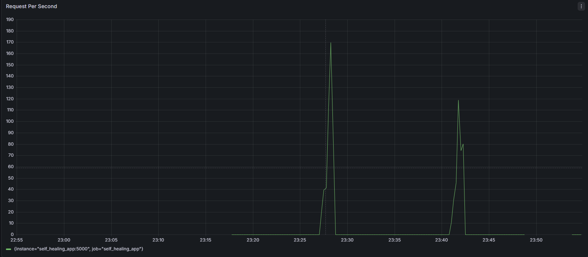
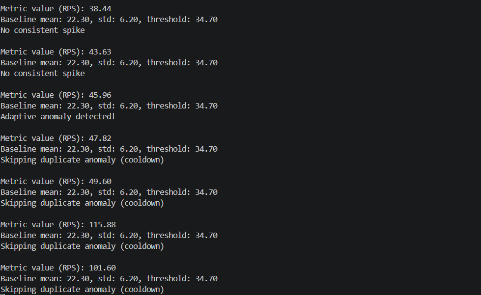
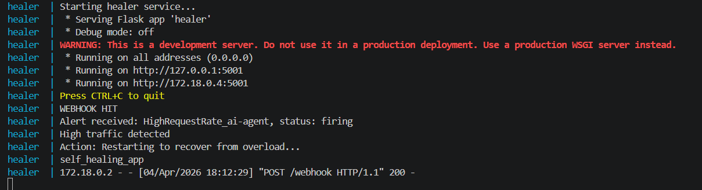

# Self-Healing DevOps AI Agent

An intelligent AIOps system that detects anomalies in application traffic using machine learning and automatically triggers corrective actions using an AI decision engine.

---

## 📌 Overview

This project demonstrates a **self-healing DevOps system** that integrates:

* 📊 **Prometheus** for monitoring
* 📈 **Grafana** for visualization
* 🧠 **ML-based anomaly detection**
* 🤖 **AI agent for decision making**
* 🔧 **Automated healing (container restart)**

---

## 🏗️ Architecture

```
User Traffic
     ↓
Flask App → Prometheus → Anomaly Detector (ML)
                               ↓
                         AI Agent (LLM)
                               ↓
                         AlertManager
                               ↓
                           Healer
                               ↓
                      Docker Container Restart
```

---

## ⚙️ Tech Stack

* Python (Flask, Requests)
* Prometheus
* Grafana
* Docker & Docker Compose
* Gunicorn
* Ollama (LLM inference)

---

## 🧠 Key Features

* ✅ Real-time traffic monitoring
* ✅ Adaptive baseline learning
* ✅ Z-score based anomaly detection
* ✅ AI-driven root cause analysis (LLM fallback)
* ✅ Automated self-healing (container restart)
* ✅ Cooldown mechanism to prevent repeated triggers
* ✅ Prometheus + Grafana visualization

---

## 📊 Dashboard & System Behavior

### 🔹 Total Requests (Spike Visualization)



👉 Shows traffic spike and sudden increase in request volume.

---

### 🔹 Requests Per Second (RPS)



👉 Used by anomaly detector to identify abnormal traffic patterns.

---

### 🔹 Anomaly Detection Logs



👉 Demonstrates:

* Baseline vs threshold comparison
* Detection of consistent spike
* Cooldown mechanism preventing duplicate triggers

---

### 🔹 Self-Healing (Container Restart)



👉 Shows:

* Alert received by healer
* Automatic container restart
* Recovery of application

---

## 🚀 How It Works

1. Application exposes metrics via `/metrics`
2. Prometheus scrapes metrics periodically
3. Anomaly detector:

   * Learns baseline traffic
   * Detects anomalies using statistical methods
4. AI agent:

   * Reads anomaly trigger
   * Uses LLM (with fallback logic)
   * Decides corrective action
5. Healer:

   * Receives alert
   * Restarts container automatically

---

## 🧪 Testing

### Generate Load

```bash
ab -n 8000 -c 200 http://localhost:5000/
```

---

## ⚠️ Challenges Faced

### 1. Prometheus Rate Calculation Issue

* `rate(...[5s])` returned empty values
* Fixed by increasing window to `[30s]`

---

### 2. Metrics Not Captured Initially

* Prometheus scrape timing mismatch
* Required continuous traffic instead of burst

---

### 3. Continuous False Triggering

* Same spike detected multiple times
* Fixed using **cooldown logic**

---

### 4. Incorrect Alert Mapping

* AI agent sent `AppDown` for traffic spike
* Fixed by mapping to `HighRequestRate`

---

### 5. Healer Container Exiting

* Flask app was not started (`app.run()` missing)
* Fixed by adding proper entrypoint

---

### 6. Prometheus Lag / Stale Metrics

* Caused repeated anomaly detection
* Fixed using stale metric handling

---

### 7. Timeout Issues Between Services

* Healer response delayed due to container restart
* Fixed by increasing request timeout

---

## 📁 Project Structure

```
self-healing-devops-agent/
│
├── app/                # Flask application
├── automation/         # AI + ML logic
│   ├── anomaly_detector.py
│   ├── ai_agent.py
│   ├── healer.py
│   ├── log_analyzer.py
│
├── monitoring/         # Prometheus configs
├── alerting/           # Alertmanager config
├── shared/             # Baseline & trigger files
├── logs/               # Application logs
├── screenshots/        # README images
├── docker-compose.yml
```

---

## 🏁 Final Outcome

✔ Fully automated anomaly detection
✔ AI-driven decision making
✔ Self-healing system (auto restart)
✔ Stable and production-ready pipeline

---

## 💡 Future Improvements

* Kubernetes auto-scaling instead of restart
* Multi-metric anomaly detection
* Advanced ML models
* Distributed tracing integration

---


